# 📱 VetClinic Mobile – Android App for Pet Owners

**VetClinic Mobile** is an Android application for pet owners to manage their pets, appointments, and profile within a veterinary clinic system. The app works entirely offline using a local SQLite database (Room), with no dependency on a web API – could be implemented in the future. It supports multiple languages, theme customization, and provides a simple, intuitive interface built in XML.

---

## 🚀 Workflow Overview

  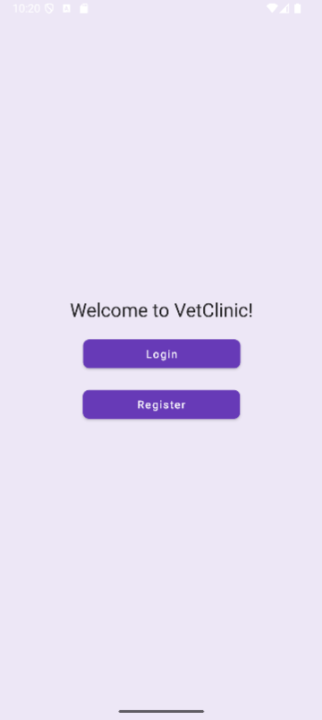

The application begins with the **Welcome Activity**, where users can:

- 👤 Register (via `RegisterFragment`)

  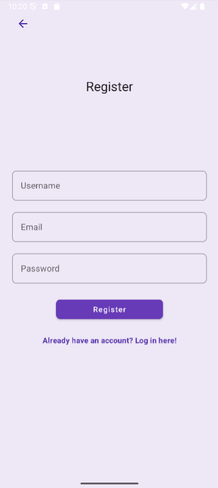

- 🔑 Log in (via `LoginFragment`)

  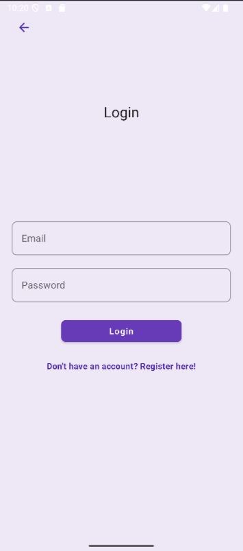

After successful login, users are redirected to the **Main Activity**, which includes a **Bottom Navigation Menu** with the following sections:

---

## 🏠 Home Fragment

  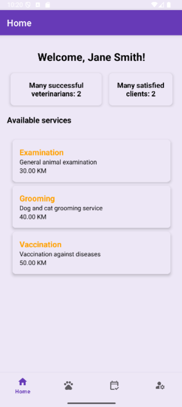

Displays:

- A personalized welcome message  
- General information about the veterinary clinic  

---

## 🐾 Pets Fragment

  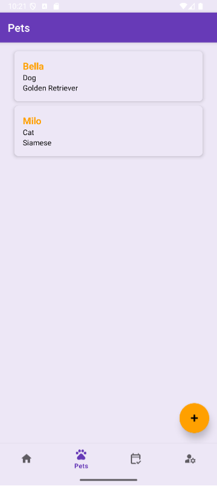

Users can:

- View a list of their pets  
- Edit or delete existing pet information by clicking on one of the pets

  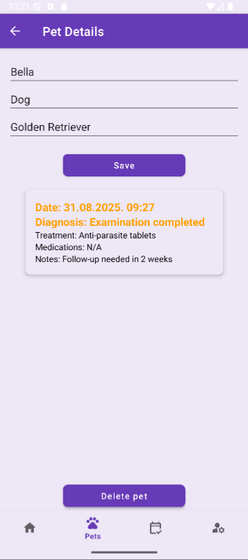

- Add a new pet by clicking on a floating action button

  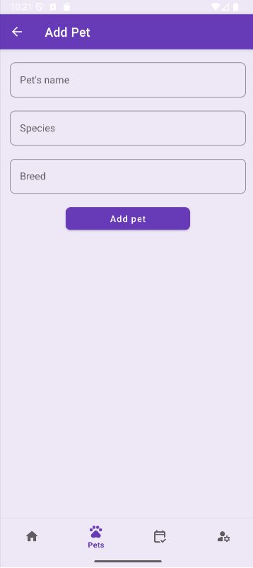

---

## 📅 Appointments Fragment

  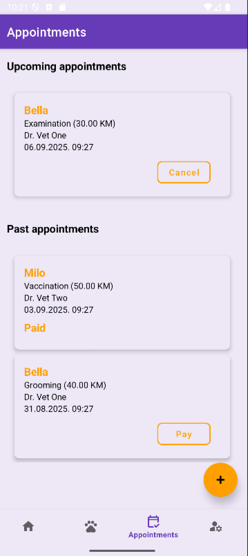

This section allows users to:

- View upcoming and past appointments  
- Cancel an existing appointment by clicking the Cancel button  
- Mark an appointment as paid by clicking the Pay button – could be implemented via Stripe in the future  
- Book a new appointment  

  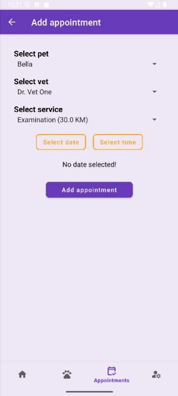

Here users choose:

- Which pet the appointment is for  
- Which veterinarian they want  
- What service they need  
- A date and time (in the future, when the vet is not already booked)

  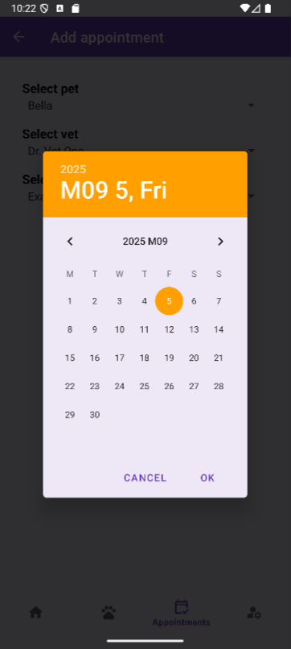

---

## 👤 Profile Fragment

  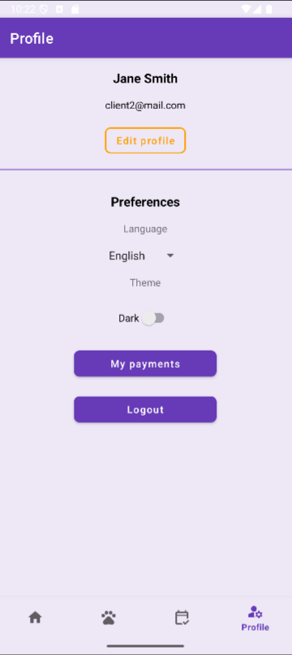

Users can:

- View their profile  
- Edit their profile (name, email, password) by clicking on the **Edit Profile** button  

  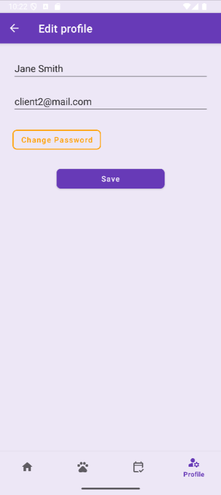

- View a history of all their payments  

  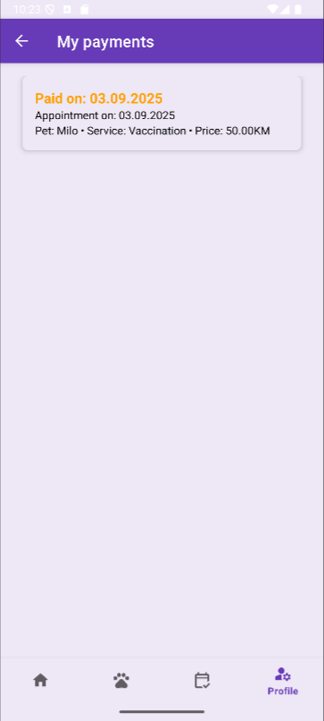

- Change the app language (English / Serbian)  
- Switch between light and dark themes  

  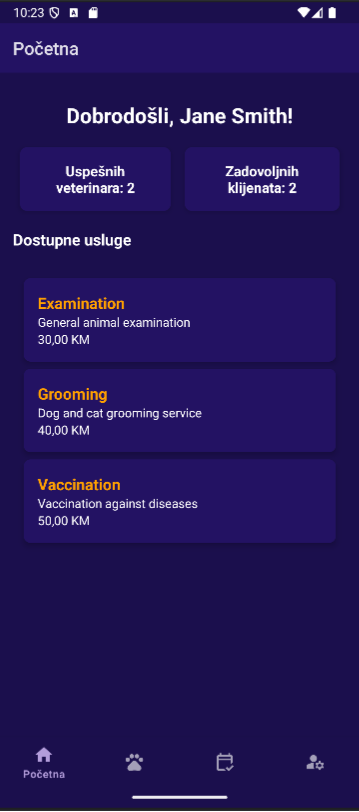

---

## ⚙️ Features Summary

- ✅ Offline-first Android app (no internet required)  
- 🐶 Manage pets and their details  
- 📅 Schedule and manage appointments  
- 💳 Simulate payments and track history  
- 🌐 Language switcher (English / Serbian)  
- 🎨 Light/Dark theme toggle  
- 🔐 Secure login and registration with local credential storage  

---

## 🛠 Technologies Used

- **Java (Android SDK)**  
- **Room (SQLite) for local database**  
- **MVVM architecture**  
- **LiveData & ViewModel**  
- **Navigation Component**  
- **Material Design Components**  
- **XML layouts**  
- **Android Emulator (for screenshots)**  

---

## 📎 Notes

- All user and appointment data is stored locally using **Room database**  
- The app is modular and can be extended with features like push notifications or cloud sync in future versions  

---

> 📸 **Make sure all screenshots are placed in the `screenshots/` folder of the repository.**
